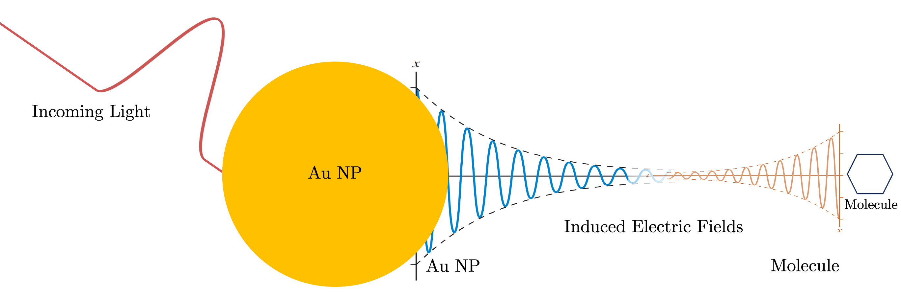

# PlasMol: Simulating Plasmon-Molecule Interactions

 <!-- Replace with your actual logo if available -->

[](https://github.com/kombatEldridge/PlasMol/blob/main/LICENSE)
[](https://www.python.org/downloads/)
[](https://github.com/kombatEldridge/PlasMol/issues)
[](https://github.com/kombatEldridge/PlasMol/stargazers) <!-- Placeholders: Update with real badges or remove -->

Read the docs: [https://kombateldridge.github.io/PlasMol/](https://kombateldridge.github.io/PlasMol/)

PlasMol is an open-source tool for simulating plasmon-molecule interactions, combining classical Finite-Difference Time-Domain (FDTD) electromagnetics with quantum Real-Time Time-Dependent Density Functional Theory (RT-TDDFT). Built on [Meep](https://meep.readthedocs.io/) for FDTD and [PySCF](https://pyscf.org/) for quantum calculations, it enables studies of nanoparticle-molecule systems, such as plasmon-enhanced spectroscopy or SERS.

Whether you're running isolated NP simulations, molecular RT-TDDFT, or full hybrid PlasMol runs, this package provides a flexible framework. For more details, see the [About page](about.md).

## Key Features

- **Simulation Modes**:
    - Classical FDTD: Simulate nanoparticles (e.g., gold/silver spheres) with custom sources.
    - Quantum RT-TDDFT: Compute molecular responses like induced dipoles or absorption spectra.
    - Full PlasMol: Couple FDTD and RT-TDDFT for plasmon-molecule dynamics.
- **Customizable Sources**: Continuous, Gaussian, chirped, or pulsed fields.
- **Outputs**: CSVs for fields/dipoles, HDF5 images/GIFs, absorption spectra, and checkpoints.
- **Propagators**: Step, RK4, or 2nd-order Magnus for RT-TDDFT.
- **Extensible**: Add custom tracking (e.g., SERS) via code injections—see [API Reference](api-reference.md).

## Quick Start

### Installation

PlasMol requires Python 3.8+ and dependencies like Meep and PySCF. For full steps, see the [Installation Guide](installation.md).

```bash
git clone https://github.com/kombatEldridge/PlasMol.git
cd PlasMol
pip install -e .
```

### Basic Usage

Run simulations via command line with an input file (e.g., from `templates/`):

```bash
python src/main.py -f templates/template-plasmol.in -vv -l plasmol.log -r
```

- `-f`: Input file path.
- `-vv`: Debug logging.
- `-l`: Log file.
- `-r`: Restart (clears old outputs).

For detailed instructions and examples, see [Usage](usage.md) and [Tutorials](tutorials.md).

#### Example: Full PlasMol Simulation

Input snippet (from `template-plasmol.in`):

```lua
start general
    dt 0.1
    t_end 4000
end general

start quantum
    start rttddft
        start geometry
            O 0.0 0.0 -0.13
            H 1.49 0.0 1.03
            H -1.49 0.0 1.03
        end geometry
        units bohr
        basis 6-31g
        xc pbe0
        propagator magnus2
    end rttddft
end quantum

start classical
    start source
        sourceType continuous
        sourceCenter -0.04
        sourceSize 0 0.1 0.1
        frequency 5
    end source
    start simulation
        cellLength 0.1
        pmlThickness 0.01
    end simulation
    start object
        material Au
        radius 0.03
        center 0 0 0
    end object
end classical
```

Outputs include field CSVs and optional GIFs/spectra.

## Documentation

- [Installation Guide](installation.md): Step-by-step setup.
- [Usage](usage.md): Input file structure and parameters.
- [Tutorials](tutorials.md): Hands-on examples for classical, quantum, and full simulations.
- [API Reference](api-reference.md): Code details for customization.
- [Contributing](contributing.md): How to add features or report issues.
- [About](about.md): Project history, releases, and citations.

## Contributing

Contributions are welcome! Whether fixing bugs, adding propagators/sources, or improving docs, check the [Contributing Guide](contributing.md) for details. Open an issue or PR on [GitHub](https://github.com/kombatEldridge/PlasMol).

We especially need help with test suites, new nanoparticle shapes, and SERS tracking.

## License

[GPL-3.0 License](https://github.com/kombatEldridge/PlasMol/blob/main/LICENSE).

## Acknowledgments

- Built on [Meep](https://meep.readthedocs.io/), [PySCF](https://pyscf.org/), NumPy, and more.
- Contributors: [Brinton Eldridge](https://github.com/kombatEldridge).
- Advisors: Dr. Daniel Nascimento, Dr. Yongmei Wang.

## Contact

- Email: [bldrdge1@memphis.edu](mailto:bldrdge1@memphis.edu)
- GitHub: [kombatEldridge](https://github.com/kombatEldridge)
- LinkedIn: [Brinton Eldridge](https://www.linkedin.com/in/brinton-eldridge/)

Star the repo if you find it useful! ⭐
