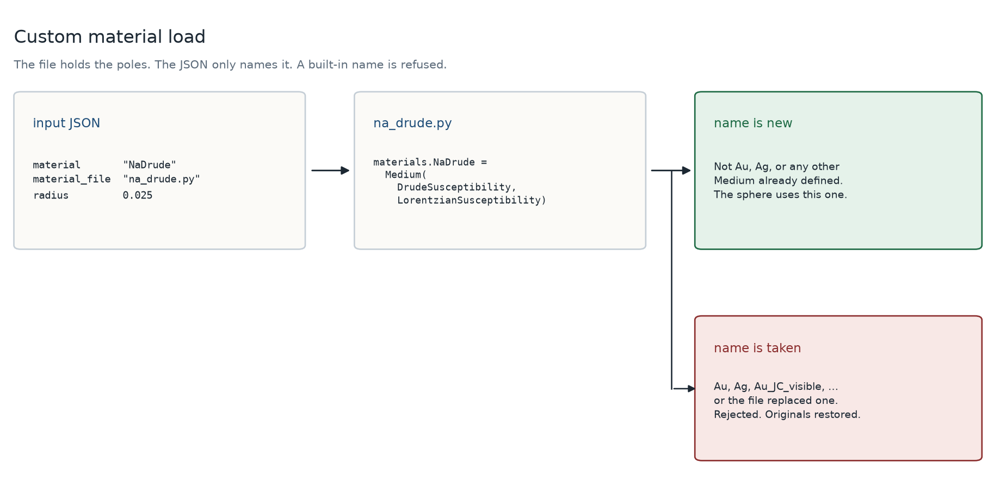

# Custom nanoparticle materials

A library metal is still a name. `"material": "Au"` is `meep.materials.Au`, and nothing else is required. A dielectric that Meep does not ship is a Python file. The JSON names the file and the attribute that file assigns. The Drude and Lorentz poles stay in the file, where a fit of several poles does not have to be flattened into the input.



## The file

The file is ordinary Python. It imports `meep.materials` and assigns one `mp.Medium`. Any number of susceptibilities can go on that object. This one is a Drude pole plus a Lorentz pole:

```python
import meep as mp
import meep.materials as materials

materials.NaDrude = mp.Medium(
    epsilon=1.0,
    E_susceptibilities=[
        mp.DrudeSusceptibility(frequency=3.6340635899, gamma=0.0427473847, sigma=1.0),
        mp.LorentzianSusceptibility(frequency=2.5, gamma=0.2, sigma=1.5),
    ],
)
```

`frequency` and `gamma` are in Meep's units, μm⁻¹ (`f = ω / 2π`). `epsilon` is ε∞. `sigma` is the dimensionless weight on that pole. These are the same objects `meep/materials.py` uses for gold and silver.

A local name is not enough. `NaDrude = mp.Medium(...)` without the `materials.` assignment is invisible to the lookup.

## The JSON

```json
{
  "nanoparticle": {
    "material": "NaDrude",
    "material_file": "na_drude.py",
    "radius": 0.025,
    "center": [0, 0, 0]
  }
}
```

| Key | Type | Description |
| --- | --- | --- |
| `material` | str | Attribute the file assigns on `meep.materials` |
| `material_file` | str | Path to that file. Relative paths are resolved from the JSON file's directory, the same way a geometry path is. Omit the key to use a built-in name |

`radius` and `center` are unchanged. Only spheres are supported.

## Names that are already materials

Before the file runs, PlasMol records every `mp.Medium` already on `meep.materials` (`Au`, `Ag`, `Au_JC_visible`, and the rest). Two checks follow.

- The `material` string itself must not be one of those names. `"material": "Au"` with a file is rejected before the file runs.
- After the file runs, no built-in `Medium` may have been replaced. A file that assigns `materials.Au = ...` is rejected, and the original objects are put back. Names the file added are removed as well, so a failed load does not leave a half-applied module.

Names that are not a `Medium` (`um_scale`, a susceptibility list, `metal_range`) are not reserved. The object stored under `material` still has to be a `Medium`.

The assignment stays on `meep.materials` for the rest of that process. A later lookup of the same new name sees it. A later lookup of `Au` still sees Meep's gold, unless a file that failed the check was rolled back.

## Where it runs

`load_meep_material` in `plasmol/utils/params_helpers/common.py` is the only loader. It runs while the input is formed, and again wherever a driver rebuilds the sphere. Hybrid jobs do that in another process: a `Medium` cannot be pickled, and on macOS the new process does not inherit the assignment. The file path is a string on the parameters, so the worker executes the file again and then looks up the name.

Leaving `material_file` out is the library path. `getattr(meep.materials, material)` is unchanged.

## See also

- [Usage](usage.md) — the `nanoparticle` keys
- [Classical driver](simulations/classical.md) — a sphere with no molecule
- [Nanoparticle cross section](simulations/np_abs_cross_sec.md) — absorption and scattering of that sphere
