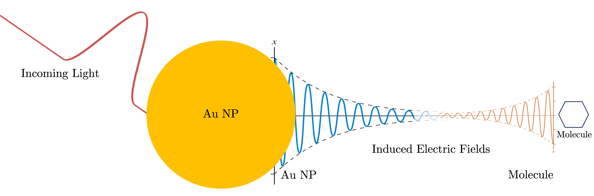

# PlasMol: Plasmon-Molecule Interactions



[](https://github.com/kombatEldridge/PlasMol/blob/main/LICENSE)
[](https://www.python.org/downloads/)

**PlasMol** is an open-source Python package for simulating plasmon-molecule interactions. It tightly couples classical Finite-Difference Time-Domain (FDTD) electromagnetics (via [Meep](https://meep.readthedocs.io/)) with quantum Real-Time Time-Dependent Density Functional Theory (RT-TDDFT) (via custom code and [PySCF](https://pyscf.org/) molecule construction).

It supports **three** primary modes (though more can be added through the [custom drivers](custom_drivers.md)):

1. **Classical FDTD** — Spherical nanoparticle (NP) simulations (e.g., Au/Ag spheres) with custom sources, symmetries, PML, and optional field imaging/GIFs or abs/scat cross-section calculations.
2. **Quantum RT-TDDFT** — Isolated molecule simulations with support for absorption spectra via Fourier transform, MO energy comparisons, [Lopata-style](https://pubs.acs.org/doi/abs/10.1021/ct400569s) CAP broadening, and checkpointing.
3. **Full Hybrid PlasMol** — Self-consistent NP + molecule simulations where the classical electric field drives quantum propagation and the induced molecular dipole is fed back as a point source in FDTD.

## Quick Start

```bash
conda create -n plasmol python=3.12
conda activate plasmol
conda install -c conda-forge pymeep

# Verify:
python -c "import meep as mp; print(mp.__version__)"

git clone https://github.com/kombatEldridge/PlasMol.git
cd PlasMol
pip install -e .
```

Run with a JSON input file:
```bash
python -m plasmol.main -f input.json -vv -l plasmol.log
```

Use `--describe` to see every supported parameter with defaults and descriptions:

```bash
python -m plasmol.main --describe
```

See the [Usage](usage.md) page for the full JSON schema and [Tutorials](tutorials.md) for complete working examples.

## Documentation Sections

- [Installation Guide](installation.md)
- [Usage](usage.md) — JSON input format, all parameters, validation rules
- [Tutorials](tutorials.md) — Step-by-step examples for classical, quantum, hybrid, spectra, etc.
- [Theory & Methodology](methodology.md)
- [Contributing](contributing.md)
- [Custom Drivers](custom_drivers.md)
- [About](about.md) — History, citation, contact

## Citation

If you use PlasMol in your work, please cite the GitHub repository:

```bibtex
@software{PlasMol,
  author = {Brinton King Eldridge},
  title = {PlasMol: Simulating Plasmon-Molecule Interactions},
  url = {https://github.com/kombatEldridge/PlasMol},
  version = {1.1.0},
  year = {2026}
}
```

## License & Acknowledgments

GPL-3.0 License. Built on Meep, PySCF, NumPy, SciPy, Matplotlib, Pandas, and Rich.

- **Developer**: Brinton King Eldridge [[Google Scholar](https://scholar.google.com/citations?hl=en&user=8OgnrHMAAAAJ)]
- **Advisors**: Dr. Daniel Nascimento [[Google Scholar](https://scholar.google.com/citations?hl=en&user=VVPFNW8AAAAJ)], Dr. Yongmei Wang [[Google Scholar](https://scholar.google.com/citations?hl=en&user=TLvIKj0AAAAJ)]
- **Association**: University of Memphis

For questions or collaboration: bldrdge1@memphis.edu or open an issue on GitHub.