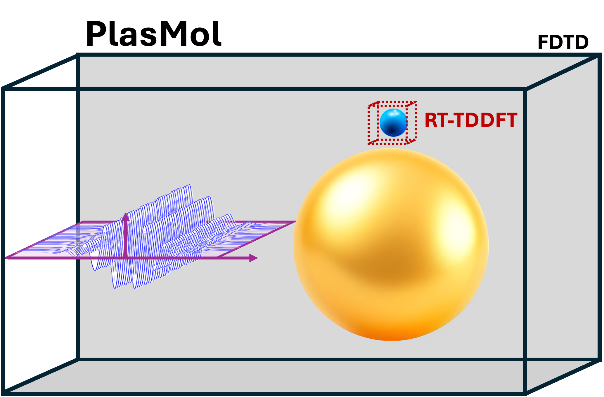

# PlasMol Documentation



**PlasMol** is an open-source Python package for simulating plasmon–molecule interactions. It couples classical Finite-Difference Time-Domain (FDTD) electromagnetics via [Meep](https://meep.readthedocs.io/) with quantum Real-Time Time-Dependent Density Functional Theory (RT-TDDFT) via [PySCF](https://pyscf.org/). A full write up of PlasMol's [methodology](methodology.md) is available.

PlasMol aims to provide users with a scaffold to measure molecular properites under the influence of enhanced electric fields from the surface of an excited nanoparticle (known as a plasmon). Users are able to add custom [simulation drivers](custom_drivers.md) and [runtime functions](contributing.md) to the source code at marked locations for ease of research. 

---

```{toctree}
:hidden:
:maxdepth: 2
:caption: Getting Started

introduction
installation
usage
tutorials
```

```{toctree}
:hidden:
:maxdepth: 2
:caption: Simulations

simulations/index
```

```{toctree}
:hidden:
:maxdepth: 2
:caption: Theory & Methodology

methodology
fourier
quasistatic_model
core_hole
```

```{toctree}
:hidden:
:maxdepth: 1
:caption: Community

contributing
custom_drivers
```

## Quick links

| Resource | Description |
|----------|-------------|
| [Installation](installation.md) | Conda + Meep setup |
| [Usage](usage.md) | JSON input schema |
| [Simulations](simulations/index.md) | Per-driver guides and templates |
| [GitHub](https://github.com/kombatEldridge/PlasMol) | Source and issues |

## Citation

```bibtex
@software{PlasMol,
  author = {Brinton King Eldridge},
  title = {PlasMol: Simulating Plasmon-Molecule Interactions},
  url = {https://github.com/kombatEldridge/PlasMol},
  version = {1.2.0},
  year = {2026}
}
```
