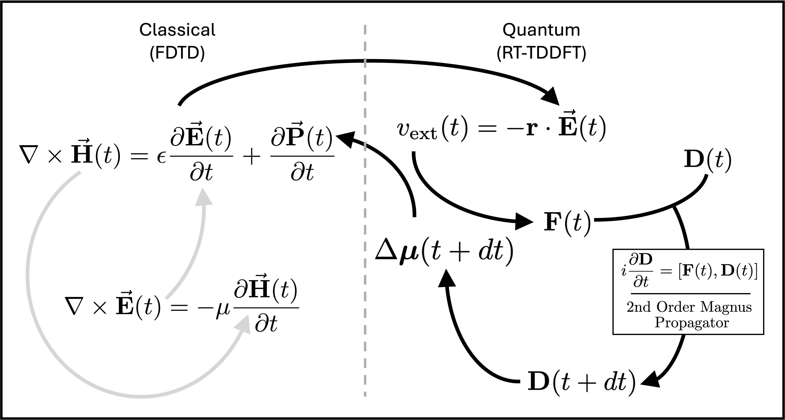

# Introduction

## Philosophy

PlasMol was created to enable research on plasmon-enhanced phenomena without having to glue together separate classical and quantum codes by hand. The bidirectional coupling (E-field → quantum propagation → induced dipole → back into FDTD) is handled automatically.

Below is a schematic showing step-by-step process behind the hybrid algorithm. Arrows in gray are handled by FDTD implementation. Note the formation of the $ \mathbf{D}(t) $ and $ \mathbf{F}(t) $ matrices is handled by PySCF’s DFT implementation. 



The codebase is intentionally **extensible**. Empty commented sections and clear extension points exist throughout so that researchers can add custom observables, sources, or post-processing with minimal friction.

## Release history

```{raw} html
<div class="release-timeline">

  <div class="timeline-item timeline-current">
    <div class="timeline-marker"></div>
    <div class="timeline-content">
      <div class="timeline-header">
        <h3>v1.2.0 <span class="timeline-date">July 2026</span> <span class="timeline-badge">Current</span></h3>
      </div>
      <ul>
        <li><strong>Core-hole driver</strong> (<code>core_hole</code>) for sudden SCH/DCH dynamics and MO hole tracking</li>
        <li>Hybrid Fourier <strong>parallel / perpendicular</strong> polarization modes with vacuum <em>E</em><sub>inc</sub> deconvolution</li>
        <li>Quasistatic Gersten–Nitzan model and hybrid spectral validation</li>
        <li>Expanded per-driver simulation docs, JSON templates, and Sphinx RTD documentation</li>
        <li>Parameter refactor (<code>params_helpers</code>) and improved validation surface</li>
      </ul>
    </div>
  </div>

  <div class="timeline-item timeline-past">
    <div class="timeline-marker"></div>
    <div class="timeline-content">
      <div class="timeline-header">
        <h3>v1.1.0 <span class="timeline-date">2025–2026</span></h3>
      </div>
      <ul>
        <li>Full migration to <strong>JSON input</strong> with schema validation and <code>--describe</code></li>
        <li><strong>Lopata CAP</strong> broadening (static and dynamic)</li>
        <li>Automatic <strong>tuning</strong> of LRC parameters and vacuum level</li>
        <li><strong>Checkpoint / restart</strong> for long quantum simulations</li>
        <li>Custom drivers: Fourier spectra, MO comparison, NP absorption / scatter response</li>
        <li>Improved multiprocessing safety, logging, and error messages</li>
      </ul>
    </div>
  </div>

  <div class="timeline-item timeline-past">
    <div class="timeline-marker"></div>
    <div class="timeline-content">
      <div class="timeline-header">
        <h3>v1.0.0 <span class="timeline-date">Initial release</span></h3>
      </div>
      <ul>
        <li>First public release of the hybrid Meep FDTD + PySCF RT-TDDFT workflow</li>
        <li>Classical, quantum, and full plasmon–molecule coupling modes</li>
        <li>Block-style input files and proof-of-concept plasmon–molecule simulations</li>
      </ul>
    </div>
  </div>

</div>
```


## Citation

There is no formal journal publication yet. If you use PlasMol, please cite:

```bibtex
@software{PlasMol,
  author = {Brinton King Eldridge},
  title = {PlasMol: Simulating Plasmon-Molecule Interactions},
  url = {https://github.com/kombatEldridge/PlasMol},
  version = {1.2.0},
  year = {2026}
}
```

## Acknowledgments

- **Developer**: Brinton King Eldridge [[Google Scholar](https://scholar.google.com/citations?hl=en&user=8OgnrHMAAAAJ)]
- **Advisors**: Dr. Daniel Nascimento [[Google Scholar](https://scholar.google.com/citations?hl=en&user=VVPFNW8AAAAJ)], Dr. Yongmei Wang [[Google Scholar](https://scholar.google.com/citations?hl=en&user=TLvIKj0AAAAJ)]
- **Association**: University of Memphis

## Contact & Community

- Email: <bldrdge1@memphis.edu>
- GitHub: <https://github.com/kombatEldridge/PlasMol>
- Issues & Pull Requests are very welcome!

## License

GPL-3.0 (see LICENSE file).
