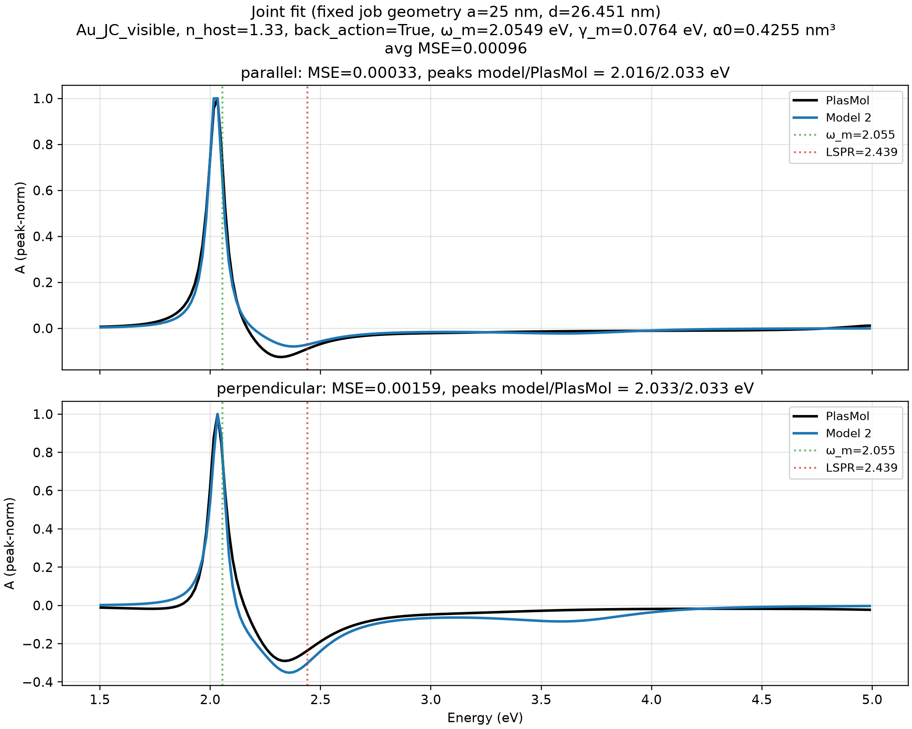
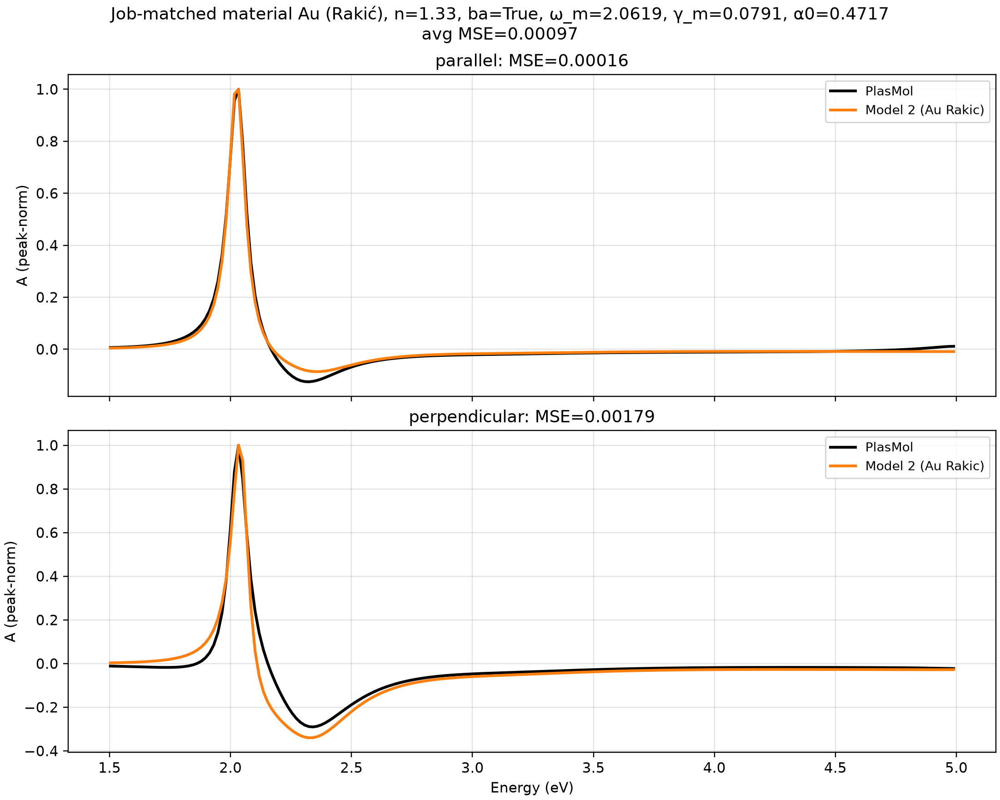

# Effective Polarizability near a Spherical Nanoparticle

These notes summarize the **Gersten–Nitzan** quasistatic model used to interpret PlasMol hybrid absorption spectra: a point-like molecule next to a dielectric (or metallic) sphere acquires an *effective* polarizability relative to the incident field \(\mathbf{E}_{\mathrm{inc}}\).

\[
\mathbf{p} = \alpha_{\mathrm{eff}}(\omega)\,\mathbf{E}_{\mathrm{inc}}.
\]

Full derivation notes live in the repository under `jobs/model2_quasistatic_sphere/effective_polarizability_derivation.pdf` (source: `.tex`). This page is the published summary plus the **joint fit** of the model to PlasMol parallel/perpendicular spectra.

## Geometry and notation

| Symbol | Meaning |
| -------- | --------- |
| \(a\) | Sphere radius |
| \(d\) | Distance from sphere center to the molecular point dipole (\(d > a\)) |
| \(\varepsilon_m(\omega)\) | Relative permittivity of the NP |
| \(\varepsilon_b\) | Host relative permittivity (real; water \(\varepsilon_b = n^2 \approx 1.769\)) |
| \(\alpha_m(\omega)\) | Bare molecular polarizability **volume** |
| \(\parallel\) | Radial: \(\mathbf{p} \parallel \hat{\mathbf{r}}\) (NP→molecule) |
| \(\perp\) | Tangential: \(\mathbf{p} \perp \hat{\mathbf{r}}\) |

Polarizabilities are written as **volumes** (cgs-like), so \(\mathbf{p} = \alpha \mathbf{E}\) without \(4\pi\varepsilon_0\).

## Bare molecular polarizability (Lorentz oscillator)

\[
\alpha_m(\omega)
=

\alpha_0
\frac{\omega_m^2}{\omega_m^2 - \omega^2 - i\gamma_m\omega},
\]

with transition frequency \(\omega_m\), linewidth \(\gamma_m\), and static volume \(\alpha_0\).

## Sphere multipoles

\[
\alpha_{\mathrm{NP}}^{(\ell)}(\omega)
=

a^{2\ell+1}
\frac{\varepsilon_m(\omega)-\varepsilon_b}
     {\varepsilon_m(\omega)+(\ell+1)\varepsilon_b/\ell},
\qquad \ell = 1,2,\ldots
\]

For \(\ell=1\) this is the usual Mie dipole polarizability of a sphere in a host.

## Dipole–dipole interaction

The quasistatic field of a point dipole yields principal values along the NP–molecule axis:

\[
M_\parallel = \frac{2}{d^3},
\qquad
M_\perp = -\frac{1}{d^3}.
\]

## Gersten–Nitzan elimination

Coupled equations for molecule and NP dipoles, eliminating the NP response, give the working formula

\[
\boxed{
\alpha_{\mathrm{eff}}
=

\frac{\alpha_m G}{1 - \alpha_m S}
}
\]

with local-field factor \(G\) and image / self-interaction propagator \(S\):

\[
G \equiv 1 + M\alpha_2,
\qquad
S \equiv M^2\alpha_2.
\]

### Point-dipole sphere (\(\alpha_2 = \alpha_{\mathrm{NP}}^{(1)}\))

**Parallel**

\[
G_\parallel = 1 + 2\frac{\alpha_{\mathrm{NP}}^{(1)}}{d^3},
\qquad
S_\parallel^{(\ell=1)} = 4\frac{\alpha_{\mathrm{NP}}^{(1)}}{d^6}.
\]

**Perpendicular**

\[
G_\perp = 1 - \frac{\alpha_{\mathrm{NP}}^{(1)}}{d^3},
\qquad
S_\perp^{(\ell=1)} = \frac{\alpha_{\mathrm{NP}}^{(1)}}{d^6}.
\]

### Multipolar image series (summary)

For small molecules \(\alpha_m S \ll 1\) and often \(S\approx 0\) is enough. When needed,

\[
S_\parallel = \sum_{\ell=1}^{\ell_{\max}} (\ell+1)^2 \frac{\alpha_{\mathrm{NP}}^{(\ell)}}{d^{2\ell+4}},
\qquad
S_\perp = \sum_{\ell=1}^{\ell_{\max}} \frac{\ell(\ell+1)}{2}\frac{\alpha_{\mathrm{NP}}^{(\ell)}}{d^{2\ell+4}}.
\]

## Absorption proxy

Relative to \(\mathbf{E}_{\mathrm{inc}}\),

\[
A(\omega) \propto -\omega\,\mathrm{Im}\,\alpha_{\mathrm{eff}}(\omega).
\]

This is the classical counterpart of PlasMol’s hybrid Fourier spectrum based on \(\mathrm{Im}[\mu(\omega)/E_{\mathrm{inc}}(\omega)]\). See [Fourier Spectra](fourier.md).

## Joint fit to PlasMol (parallel + perpendicular)

Model spectra were fit jointly to PlasMol hybrid Fourier jobs in the **parallel** and **perpendicular** polarizations (geometry fixed from the Na / Au nanoparticle setup).

**Geometry (fixed)**

- \(a = 25\,\mathrm{nm}\)
- \(d = 26.451\,\mathrm{nm}\) (gap \(1.451\,\mathrm{nm}\))
- Objective: mean peak-normalized MSE over both orientations

### Recommended parameters (best average MSE)

| Parameter | Value |
| ----------- | -------- |
| material | `Au_JC_visible` |
| \(n_{\mathrm{host}}\) | 1.33 (\(\varepsilon_b \approx 1.7689\)) |
| back-action \(\alpha_m S\) | True |
| \(\ell_{\max}\) | 25 |
| \(\omega_m\) | **2.054920 eV** |
| \(\gamma_m\) | **0.076360 eV** |
| \(\alpha_0\) | **0.42546 nm³** |
| Fröhlich LSPR | 2.439111 eV |
| avg MSE | **0.000961** |
| parallel | MSE 0.000330; peaks model 2.0160 / PlasMol 2.0331 eV |
| perpendicular | MSE 0.001592; peaks both 2.0331 eV |

### Runner-up (Rakić `Au`)

| Parameter | Value |
| ----------- | -------- |
| material | `Au` |
| \(n_{\mathrm{host}}\) | 1.33, back-action True |
| \(\omega_m\), \(\gamma_m\), \(\alpha_0\) | 2.0619 eV, 0.0791 eV, 0.4717 nm³ |
| avg MSE | 0.000974 |

### Fit figures

### Interpretation notes

- PlasMol hybrid jobs often use material key `"Au"` and **vacuum** reference fields; \(n_{\mathrm{host}}=1.33\) still fits better because it red-shifts the quasistatic LSPR and improves the hybrid lineshape versus DFT/Meep data.
- Back-action (\(\alpha_m S\)) helps slightly; \(\alpha_0 \sim 0.4\,\mathrm{nm}^3\) is an *effective* classical polarizability volume, not a bare gas-phase value.
- Free-gap optimization drove the gap toward a lower bound (0.5 nm) and was **rejected** as inconsistent with the actual job geometry.

## Limitations

- Quasistatic (\(d \ll \lambda\)); no retardation.
- Local bulk \(\varepsilon_m(\omega)\); no nonlocal or quantum-size NP corrections.
- Point molecule; no spatial extent or multipolar molecular response.
- Linear classical response; host \(\varepsilon_b\) real and constant.

## See also

- [Fourier Spectra](fourier.md) — hybrid \(\mu/E_{\mathrm{inc}}\) and parallel/perpendicular modes
- [Theory & Methodology](../methodology.md) — self-consistent FDTD–RT-TDDFT loop
