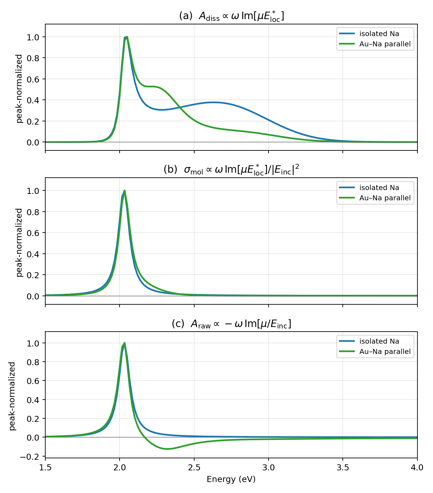
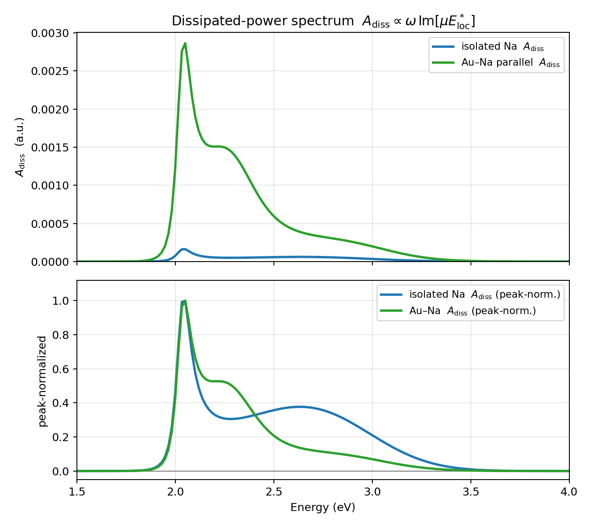
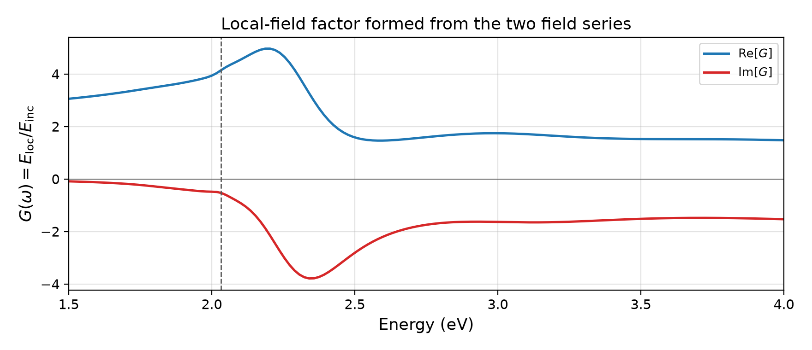
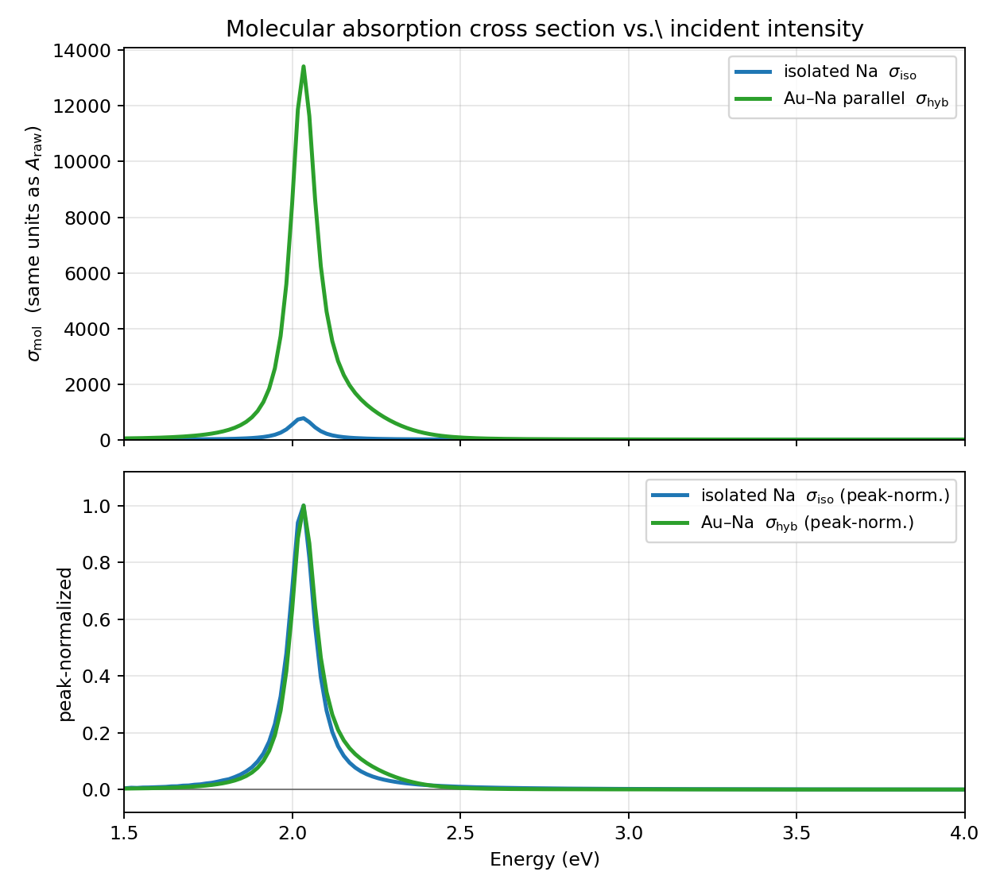
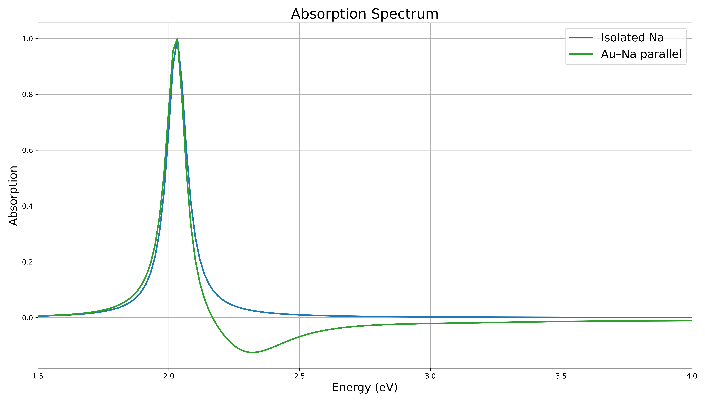

# Hybrid absorption observables

The same three hybrid time series produce **three different spectra**. They are not three normalizations of one curve: they differ in which field sits next to the molecular dipole \(\mu\), and whether that bilinear form is then divided by the incident intensity.

This page is the theory of those observables. Polarization modes, DFT windows, and \(\mu/E_{\mathrm{inc}}\) deconvolution are in [Fourier Spectra](fourier.md). JSON keys and templates are in [Simulations: Absorption](simulations/absorption.md) and [Usage](usage.md).

Request them with `settings.driver.observables`. The default is `["cross_section"]`.

```json
"observables": ["cross_section", "dissipative_power", "A_raw"]
```

| Driver name | Symbol | What it answers |
| -------------- | -------- | ----------------- |
| `dissipative_power` | \(A_{\mathrm{diss}}\) | How much the molecule absorbs from the **local** field |
| `cross_section` | \(\sigma_m\) | That absorption referred to the **incident flux** (default) |
| `A_raw` | \(A_{\mathrm{raw}}\) | The molecular dipole as seen from the **incident wave** |



Peak-normalized hybrid (green) and isolated-Na (blue) spectra for a 25 nm Au sphere with Na on the \(+x\) axis (gap \(1.45\,\mathrm{nm}\)). (a) \(A_{\mathrm{diss}}\) still carries \(\lvert E_{\mathrm{inc}}\rvert^2\) when isolated. (b) \(\sigma_m\), pulse divided out. (c) \(A_{\mathrm{raw}}\); this is the only panel allowed to go negative.

---

## Three recorded series

A hybrid production run writes the electric field and induced dipole at the molecular site. A vacuum reference (same source and cell, no NP, no molecule) writes the incident field at the same point.

| Series | File | Meaning |
| -------- | ------ | --------- |
| \(E_{\mathrm{loc}}(t)\) | production `fields/field_e.csv` | Field felt by the molecule (NP scattering included) |
| \(\mu(t)\) | production `fields/field_p.csv` | RT-TDDFT induced dipole of the **molecule only** |
| \(E_{\mathrm{inc}}(t)\) | vacuum `fields/field_e_ref.csv` | Incident field at the same sample point |

In the frequency domain

$$
E_{\mathrm{loc}}(\omega)
=
E_{\mathrm{inc}}(\omega)+E_{\mathrm{scat}}(\omega).
$$

Linear response of the molecule is always to the field at its location,

$$
\mu(\omega)
=
\alpha_m(\omega)\,E_{\mathrm{loc}}(\omega),
$$

with \(\alpha_m\) the molecular polarizability of the RT-TDDFT model (CAP included). Discrete Fourier transforms use the same convention as the absorption driver,

$$
f(\omega_k)
=
\Delta t\sum_{n=0}^{N-1} f(t_n)\,e^{-\mathrm{i}\omega_k t_n},
\qquad
\omega_k
=
\frac{2\pi k}{N\Delta t}.
$$

The three traces are real; their transforms are nevertheless complex. Shared pulse-delay phase cancels in ratios such as \(E_{\mathrm{loc}}/E_{\mathrm{inc}}\) and \(\mu/E_{\mathrm{inc}}\).

---

## Cycle-averaged power

The instantaneous power delivered to a classical dipole by the field at its location is

$$
P(t)
=
\dot{\mu}(t)\,E_{\mathrm{loc}}(t).
$$

That product oscillates: half the cycle the field does work on the dipole, the other half the dipole does work on the field. The sloshing is reactive energy, not absorption. Net transfer is the cycle average.

Write real fields as phasors \(e^{-\mathrm{i}\omega t}\) (Jackson). For two real harmonics \(A=\operatorname{Re}[\tilde A e^{-\mathrm{i}\omega t}]\) and \(B=\operatorname{Re}[\tilde B e^{-\mathrm{i}\omega t}]\), the double-frequency terms average to zero over \(T=2\pi/\omega\), leaving

$$
\overline{AB}
=
\tfrac12\operatorname{Re}\bigl[\tilde A\tilde B^{\ast}\bigr].
$$

With \(\tilde A=-\mathrm{i}\omega\tilde\mu\) and \(\tilde B=\tilde E_{\mathrm{loc}}\),

$$
\overline{P}
=
\tfrac12\operatorname{Re}\bigl[(-\mathrm{i}\omega\tilde\mu)\tilde E_{\mathrm{loc}}^{\ast}\bigr]
=
\frac{\omega}{2}
\operatorname{Im}\bigl[\tilde\mu\,\tilde E_{\mathrm{loc}}^{\ast}\bigr].
$$

Insert \(\mu=\alpha_m E_{\mathrm{loc}}\) and \(\lvert E_{\mathrm{loc}}\rvert^2=E_{\mathrm{loc}}E_{\mathrm{loc}}^{\ast}\):

$$
\overline{P}
=
\frac{\omega}{2}
\operatorname{Im}[\alpha_m]\,
\lvert\tilde E_{\mathrm{loc}}\rvert^{2}.
$$

The Meep source is not a single harmonic. Linearity means each Fourier component of \(E_{\mathrm{loc}}\) drives its own \(\mu(\omega)\). The same bilinear form on the DFTs is the spectral density of \(P(t)\):

$$
\overline{P}(\omega)
=
\frac{\omega}{2}
\operatorname{Im}\bigl[\mu(\omega)\,E_{\mathrm{loc}}^{\ast}(\omega)\bigr]
=
\frac{\omega}{2}
\operatorname{Im}[\alpha_m(\omega)]\,
\lvert E_{\mathrm{loc}}(\omega)\rvert^{2}.
$$

---

## `dissipative_power` — \(A_{\mathrm{diss}}\)

Equation \(\overline{P}(\omega)\) is already the dissipated-power spectrum. To plot it next to a polarizability-like curve, PlasMol applies the same \(4\pi\omega/c\) dressing used for a plane-wave cross section, and the DFT sign flip that turns a physical absorption peak upward:

$$
A_{\mathrm{diss}}(\omega)
=
-\frac{4\pi\omega}{c}
\operatorname{Im}\bigl[\mu(\omega)\,E_{\mathrm{loc}}^{\ast}(\omega)\bigr].
$$



\(A_{\mathrm{diss}}\) for Au–Na parallel (green) and isolated Na (blue). Top: un-normalized. Bottom: peak-normalized. Isolated Na still carries \(\lvert E_{\mathrm{inc}}\rvert^2\); hybrid extra height and the \(\sim 2.2\,\mathrm{eV}\) shoulder come from \(\lvert E_{\mathrm{loc}}\rvert^2\).

Isolated Na has no nanoparticle, so \(E_{\mathrm{loc}}=E_{\mathrm{inc}}\) and \(\mu^{\mathrm{iso}}=\alpha_m E_{\mathrm{inc}}\):

$$
A_{\mathrm{diss}}^{\mathrm{iso}}(\omega)
=
-\frac{4\pi\omega}{c}\,
\operatorname{Im}\bigl[\mu^{\mathrm{iso}}(\omega)\,E_{\mathrm{inc}}^{\ast}(\omega)\bigr]
=
-\frac{4\pi\omega}{c}\,
\operatorname{Im}[\alpha_m(\omega)]\,
\lvert E_{\mathrm{inc}}(\omega)\rvert^{2}.
$$

Peak-normalized isolated \(A_{\mathrm{diss}}\) is **not** a Lorentzian: it follows the pulse envelope. Dividing out \(\lvert E_{\mathrm{inc}}\rvert^2\) removes that envelope and produces a different observable — the molecular absorption cross section.

---

## Local-field factor

$$
G(\omega)
:=
\frac{E_{\mathrm{loc}}(\omega)}{E_{\mathrm{inc}}(\omega)}.
$$

Isolated Na has \(G=1\). The shared delay phase of the pulse drops out of the ratio, so the structure left in \(G\) is scattering from the NP.



Local-field factor \(G=E_{\mathrm{loc}}/E_{\mathrm{inc}}\). Dashed line: Na resonance.

Then \(\mu/E_{\mathrm{inc}}=\alpha_m G\). Defining \(\alpha_{\mathrm{eff}}:=\alpha_m G\) (or, with back-action, the Gersten–Nitzan form \(\alpha_m G/(1-\alpha_m S)\); see [Quasistatic Model](quasistatic_model.md)),

$$
\mu(\omega)
=
\alpha_{\mathrm{eff}}(\omega)\,E_{\mathrm{inc}}(\omega).
$$

The molecule still responds to \(E_{\mathrm{loc}}\); \(\alpha_{\mathrm{eff}}\) is that response as seen from the source. The extra height of hybrid \(A_{\mathrm{diss}}\) is \(\lvert G\rvert^2\).

---

## `cross_section` — \(\sigma_m\)

A cross section is power over incident flux. A plane wave in Gaussian units has time-averaged Poynting intensity

$$
I_{\mathrm{inc}}(\omega)
=
\frac{c}{8\pi}\lvert E_{\mathrm{inc}}(\omega)\rvert^{2}.
$$

The molecular absorption cross section referred to that vacuum wave is

$$
\sigma_m(\omega)
:=
\frac{\overline{P}(\omega)}{I_{\mathrm{inc}}(\omega)}
=
\frac{4\pi\omega}{c}
\frac{\operatorname{Im}\bigl[\mu(\omega)\,E_{\mathrm{loc}}^{\ast}(\omega)\bigr]}{\lvert E_{\mathrm{inc}}(\omega)\rvert^{2}}
=
\frac{4\pi\omega}{c}
\operatorname{Im}[\alpha_m(\omega)]\,
\lvert G(\omega)\rvert^{2}.
$$

(The driver applies the same DFT sign convention as \(A_{\mathrm{diss}}\), so plotted \(\sigma_m\) is upright at a passive resonance.) The nanoparticle enters only through \(\lvert G\rvert^2\). A passive molecule has \(\operatorname{Im}\alpha_m\ge 0\), so \(\sigma_m\ge 0\).



\(\sigma_m\) for Au–Na parallel (green) and isolated Na (blue). Top: un-normalized. Bottom: peak-normalized.

After peak-normalization the hybrid and isolated \(\sigma_m\) look almost the same: overall \(\lvert G\rvert^2\) height is stripped. Residual lineshape mismatch is a slow tilt of \(\lvert G(\omega)\rvert^2\) across the molecular line, not a second resonance.

This is the **default** absorption observable.

---

## `A_raw` — dipole vs the incident wave

Both \(A_{\mathrm{diss}}\) and \(\sigma_m\) are built from the field that actually sits on the atom, so they answer how much the **molecule** absorbs. They cannot tell how that absorption appears to the incoming wave: \(E_{\mathrm{loc}}\) already contains the nanoparticle, and contracting with it removes the phase of the gap field.

The experimentally controlled quantity is \(E_{\mathrm{inc}}\). An optical experiment does not have a probe in the gap; it knows the wave that was launched. A Gersten–Nitzan model is written in that same field:

$$
\alpha_{\mathrm{eff}}
=
\frac{\alpha_m G}{1-\alpha_m S}
=
\frac{\mu}{E_{\mathrm{inc}}}.
$$

Dividing \(\mu\) by \(E_{\mathrm{loc}}\) undoes the nanoparticle on purpose and recovers \(\alpha_m\). That is a useful check of back-action; it is not a hybrid lineshape.

The same dipole referred to \(E_{\mathrm{inc}}\) is the molecular response as seen from the source. The bookkeeping analogue of \(P(t)\) is \(P_{\mathrm{inc}}(t)=\dot{\mu}(t)E_{\mathrm{inc}}(t)\) (not mechanical power into the atom). Cycle averaging and dividing by \(I_{\mathrm{inc}}\) gives

$$
A_{\mathrm{inc}}(\omega)
=
\frac{4\pi\omega}{c}
\operatorname{Im}\!\left[\frac{\mu(\omega)}{E_{\mathrm{inc}}(\omega)}\right]
=
\frac{4\pi\omega}{c}
\operatorname{Im}[\alpha_{\mathrm{eff}}(\omega)].
$$

PlasMol plots the DFT-upright copy

$$
A_{\mathrm{raw}}(\omega)
=
-\frac{4\pi\omega}{c}
\operatorname{Im}\!\left[\frac{\mu(\omega)}{E_{\mathrm{inc}}(\omega)}\right]
=
-\frac{4\pi\omega}{c}
\operatorname{Im}[\alpha_{\mathrm{eff}}(\omega)].
$$

Expanding the imaginary part,

$$
\operatorname{Im}[\alpha_{\mathrm{eff}}]
=
\operatorname{Im}[\alpha_m G]
=
\operatorname{Im}[\alpha_m]\,\operatorname{Re}[G]
+
\operatorname{Re}[\alpha_m]\,\operatorname{Im}[G].
$$

The first term is the even Lorentzian, weighted by \(\operatorname{Re}[G]\). The second is the odd (dispersive) wing of \(\alpha_m\) weighted by the phase of the near field. As soon as \(\operatorname{Im}[G]\neq 0\), that product can go negative on the blue side of the line. Isolated Na has \(\operatorname{Im}[G]\simeq 0\), so \(A_{\mathrm{raw}}\) stays non-negative.



Peak-normalized \(A_{\mathrm{raw}}\) for Au–Na parallel (green) and isolated Na (blue). The hybrid curve crosses zero and develops a negative lobe on the blue side of the Na line.

\(\mu\) in \(A_{\mathrm{raw}}\) is still only the atom. \(A_{\mathrm{raw}}\) is not the extinction of Au+Na, and it is not \(\operatorname{Im}[\mathbf{p}_{\mathrm{tot}}/E_{\mathrm{inc}}]\). It is the molecular dipole expressed in the only field an experiment or a classical hybrid model actually knows.

---

## The three together

$$
\begin{aligned}
A_{\mathrm{diss}}(\omega)
&=
-\frac{4\pi\omega}{c}
\operatorname{Im}\bigl[\mu(\omega)\,E_{\mathrm{loc}}^{\ast}(\omega)\bigr],
\\[0.4em]
\sigma_m(\omega)
&=
\frac{4\pi\omega}{c}
\frac{\operatorname{Im}\bigl[\mu(\omega)\,E_{\mathrm{loc}}^{\ast}(\omega)\bigr]}{\lvert E_{\mathrm{inc}}(\omega)\rvert^{2}}
=
\frac{4\pi\omega}{c}
\operatorname{Im}[\alpha_m(\omega)]\,\lvert G(\omega)\rvert^{2},
\\[0.4em]
A_{\mathrm{raw}}(\omega)
&=
-\frac{4\pi\omega}{c}
\operatorname{Im}\!\left[\frac{\mu(\omega)}{E_{\mathrm{inc}}(\omega)}\right].
\end{aligned}
$$

| Observable | Partner field | Pulse envelope | Can go negative? |
| ------------ | --------------- | ---------------- | ------------------ |
| \(A_{\mathrm{diss}}\) | \(E_{\mathrm{loc}}\) | Yes (\(\lvert E_{\mathrm{loc}}\rvert^2\)) | No (passive \(\alpha_m\)) |
| \(\sigma_m\) | \(E_{\mathrm{loc}}\), then \(\div I_{\mathrm{inc}}\) | Divided out | No |
| \(A_{\mathrm{raw}}\) | \(E_{\mathrm{inc}}\) (ratio) | Divided out | Yes, if \(\operatorname{Im}[G]\neq 0\) |

No extra FDTD or RT-TDDFT is required: production `fields/field_e.csv` / `fields/field_p.csv` and vacuum `fields/field_e_ref.csv` already contain \(E_{\mathrm{loc}}\), \(\mu\), and \(E_{\mathrm{inc}}\).

---

## Driver input and outputs

```json
{
  "name": "absorption",
  "polarization": "parallel",
  "spectrum_filepath": "spectrum.png",
  "observables": ["cross_section", "dissipative_power", "A_raw"]
}
```

- One observable: write `spectrum_filepath` (PNG + `.csv`).
- Several: `{stem}_cross_section.png`, `{stem}_dissipative_power.png`, `{stem}_A_raw.png`.
- Optional `npz_filepath` stores frequencies and the un-normalized / peak-normalized arrays.

Quantum-only \(\delta\)-kicks have no \(E_{\mathrm{loc}}\) vs \(E_{\mathrm{inc}}\) split. There the kick field plays both roles; `A_raw` reduces to \(\operatorname{Im}\mu\) (flat source), and `cross_section` uses the kick as \(E_{\mathrm{inc}}\). Isolated hybrid comparisons (no NP, same pulse) are a **second job**, not a second trajectory inside the NP run.

---

## Conventions

- Phasors follow \(e^{-\mathrm{i}\omega t}\) (Jackson). The cycle average \(\tfrac12\operatorname{Re}[\tilde A\tilde B^{\ast}]\) is Jackson §6.9; the vacuum intensity \(c\lvert E\rvert^2/8\pi\) is the Gaussian form of §7.1. The step to \(\sigma=(4\pi\omega/c)\operatorname{Im}\alpha\) is the dipole reduction of the optical theorem.
- Minus signs on \(A_{\mathrm{diss}}\) and \(A_{\mathrm{raw}}\) are DFT bookkeeping so a passive Lorentzian points up. The driver then applies a global sign choice if the strongest \(\lvert A\rvert\) feature is still negative.
- The plotted prefactor uses \(\omega\) on the display energy axis (eV) and \(c\) in atomic units, so the **absolute scale is not a clean area**. Peak-normalized shapes are the intended comparison. Isolated overlays in the figures above are a separate molecule-only (or empty-cell) run.

---

## See also

- [Fourier Spectra](fourier.md) — DFT windows, \(\mu/E_{\mathrm{inc}}\) deconvolution, parallel / perpendicular / single
- [Quasistatic Model](quasistatic_model.md) — Gersten–Nitzan \(G\), \(S\), and \(\alpha_{\mathrm{eff}}\)
- [Theory & Methodology](methodology.md) — hybrid time loop and RT-TDDFT
- [Simulations: Absorption](simulations/absorption.md) — driver usage
- [Usage](usage.md) — `observables` in the JSON schema
