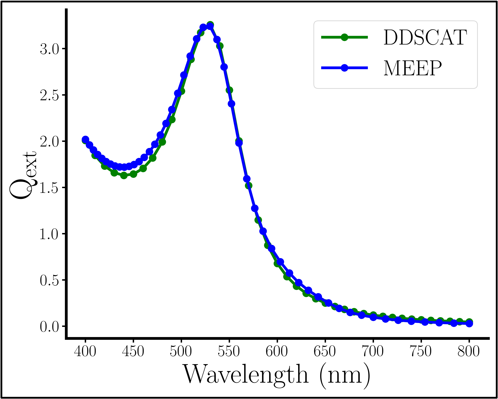
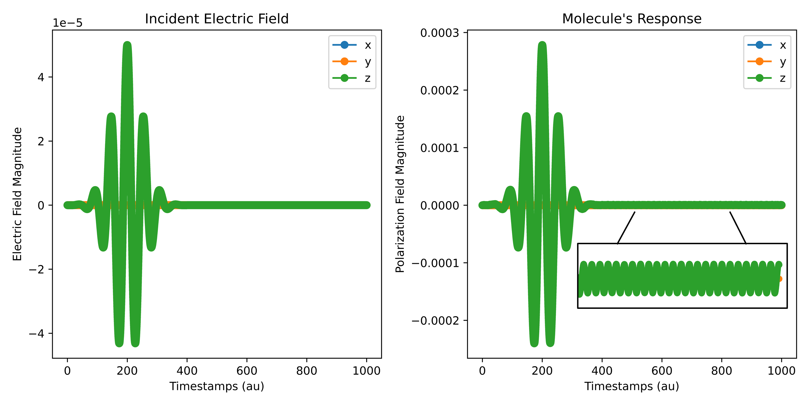
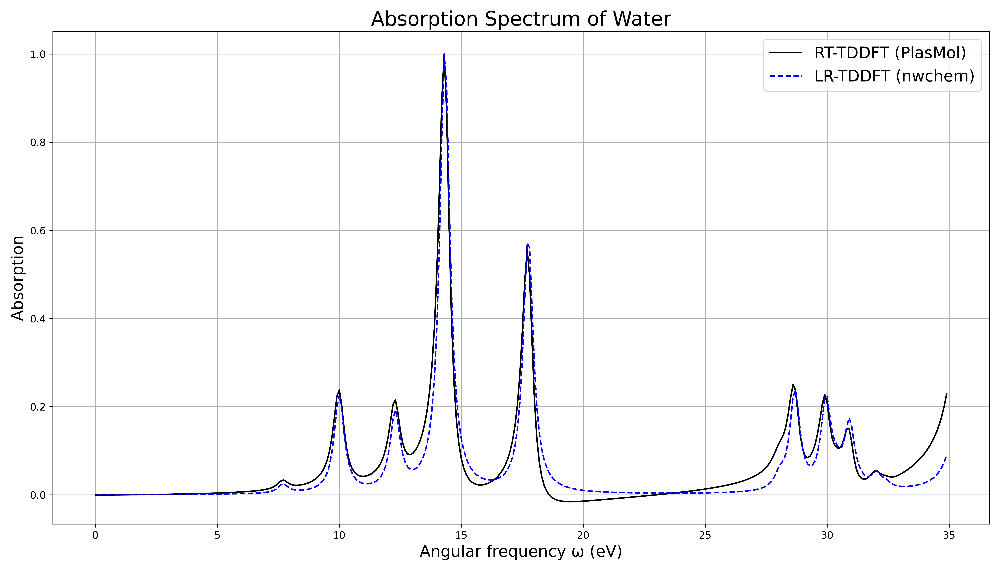

# Tutorials

This section provides hands-on tutorials for using PlasMol. Each tutorial uses a template input file from the `templates/` directory. Run commands from your project root, e.g.:

```bash
python plasmol/main.p -f templates/template-classical.in -vv -l plasmol.log
```

Outputs will appear in your working directory (e.g., CSVs, images).

## Tutorial 1: Classical NP Simulation (FDTD Only)

Simulate a gold nanoparticle interacting with a continuous electric field. This demonstrates basic FDTD output, including the optional cross-section images.

1. **Prepare Input**: Copy `template-classical.in` and adjust parameters (e.g., increase `t_end` for longer simulation). Example snippet:

  ```lua
    start general -- 'general' block wrappers are not necessary
        dt 0.1 -- au
        t_end 50  -- au
        eField_path eField.csv
    end general

    -- classical portion
    start classical
        start source
            sourceType continuous
            sourceCenter -0.04
            sourceSize 0 0.1 0.1
            frequency 5
        end source

        start simulation
            cellLength 0.1
            pmlThickness 0.01
            -- spherical objects with an incident electric field propagating in the
            -- +y direction with a z electric component will have the following symmetry
            symmetries Y 1 Z -1
            surroundingMaterialIndex 1.33 -- surrounds NP in water
        end simulation

        start object
            material Au
            radius 0.03
            center 0 0 0
        end object

        start hdf5
            timestepsBetween 1 -- saves a picture every timestep
            intensityMin 3
            intensityMax 10
            imageDirName hello -- saves images to path hello/.
        end hdf5
    end classical
  ```

2. **Run Simulation**:

   ```bash
   python plasmol/main.py -f /path/to/classical.in -vv -l plasmol.log
   ```

   or

   ```bash
   python -m plasmol.main -f /path/to/classical.in -vv -l plasmol.log
   ```

3. **View Outputs**:

    - `eField.csv`: Electric field data. Path defined in input file.
    - `hello/`: PNG cross-sections (if HDF5 enabled); a GIF is auto-generated.
    
    *Cross-section of a spherical nanoparticle in the xy-plane receiving incident light, whose electric component is measured in the z-direction. Dashed outline added for clarity.*

    - For extinction spectra, add custom tracking in `plasmol/classical/simulation.py` (see [API Reference](api-reference.md)).
    
    *Using instructions from [MEEP's documentation](https://meep.readthedocs.io/en/master/Python_Tutorials/Basics/#mie-scattering-of-a-lossless-dielectric-sphere) and [code examples](https://github.com/NanoComp/meep/blob/04ae6b786ab145a35ab8d290ede4cdce105d0677/python/examples/mie_scattering.py), one can compare the Qext spectrum between the FDTD and DDA methods, implemented using MEEP and DDSCAT respectively.*

## Tutorial 2: Quantum Molecule Simulation (RT-TDDFT Only)

Compute the induced dipole of a water molecule using a pulsed field. This uses only RT-TDDFT.

1. **Prepare Input**: Copy `template-quantum.in`. Unless you want an absorption spectrum (see [Tutorial 3](#tutorial-3-molecular-absorption-spectrum-rt-tddft-with-transform-flag)), do *not* add `transform` to rttddft block.

    Example snippet:

    ```lua
    start general -- 'general' block wrappers are not necessary
        dt 0.05 -- au
        t_end 1000  -- au
        eField_path eField.csv
    end general

    -- rt-tddft portion
    start quantum
        start rttddft
            start geometry
                O      0.0000000000       0.0000000000       -0.1302052882
                H      1.4891244004       0.0000000000        1.0332262019
                H     -1.4891244004       0.0000000000        1.0332262019
            end geometry
            units bohr
            check_tolerance 1e-12
            charge 0
            spin 0
            basis 6-31g
            xc pbe0
            resplimit 1e-20
            propagator magnus2
            pc_convergence 1e-12
            maxiter 200
            transform -- important to include this flag for abs spectrum simulation
        end rttddft

        start files
            start checkpoint -- in case simulation crashes
                frequency 100
                path checkpoint.npz
            end checkpoint
            pField_path pField.csv
            pField_Transform_path pField-transformed.npz
            eField_vs_pField_path output.png
            eV_spectrum_path spectrum.png -- this image will display the absorption spectrum
        end files

        start source
            shape pulse
            peak_time_au 200
            width_steps 1000
            wavelength_nm 400 -- nm
            intensity_au 5e-5
            dir z
        end source  
    end quantum
    ```

2. **Run Simulation**:

    ```bash
    python plasmol/main.py -f /path/to/quantum.in -vv -l plasmol.log -r
    ```

    or

    ```bash
    python -m plasmol.main -f /path/to/quantum.in -vv -l plasmol.log -r
    ```

3. **View Outputs**:
    - `eField.csv`: Incident field; plots using `plasmol/utils/plotting.py` for visualization.
    - `pField.csv`: Induced dipole (polarization) data.

    
    *Example spectra comparing a pulse felt by the molecule (left) with the molecule's induced dipole (right). Inset highlights molecules small oscillations due to excitement.*

## Tutorial 3: Molecular Absorption Spectrum (RT-TDDFT with `transform` flag)

Compute the absorption spectrum of a water molecule using three Dirac delta kicks. This uses multithreaded RT-TDDFT and Fourier transform.

1. **Prepare Input**: Copy `template-quantum.in`. Enable `transform` for spectrum calculation.

    Example snippet:

    ```lua
    start general -- 'general' block wrappers are not necessary
        dt 0.1 -- au
        t_end 4000  -- au
        eField_path eField.csv
    end general

    -- rt-tddft portion
    start quantum
        start rttddft
            start geometry
                O      0.0000000000       0.0000000000       -0.1302052882
                H      1.4891244004       0.0000000000        1.0332262019
                H     -1.4891244004       0.0000000000        1.0332262019
            end geometry
            units bohr
            check_tolerance 1e-12
            charge 0
            spin 0
            basis 6-31g
            xc pbe0
            resplimit 1e-20
            propagator magnus2
            pc_convergence 1e-12
            maxiter 200
            transform -- important to include this flag for abs spectrum simulation
        end rttddft

        start files
            start checkpoint -- in case simulation crashes
                frequency 100
                path checkpoint.npz
            end checkpoint
            pField_path pField.csv
            pField_Transform_path pField-transformed.npz
            eField_vs_pField_path output.png
            eV_spectrum_path spectrum.png -- this image will display the absorption spectrum
        end files

        start source
            shape kick -- needs to be a delta 'kick', not 'pulse'
            peak_time_au 0.1
            width_steps 5
            intensity_au 5e-5
            -- dir z -- do not need to specify direction when transform flag used
        end source  
    end quantum
    ```

2. **Run Simulation**:

    ```bash
    python plasmol/main.py -f /path/to/abs_spectrum.in -vv -l plasmol.log -r
    ```

    or

    ```bash
    python -m plasmol.main -f /path/to/abs_spectrum.in -vv -l plasmol.log -r
    ```

3. **View Outputs**:
    - `pField.csv`: Induced dipole (polarization) data.
    - `spectrum.png`: Absorption spectrum plot.

    
    *Absorption spectrum run as compared to an LR-TDDFT standard from nwchem.*

## Tutorial 4: Full PlasMol Simulation (NP + Molecule)

Simulate a gold NP with a water molecule inside, tracking plasmon-molecule interactions.

1. **Prepare Input**: Copy `template-plasmol.in`. Combine classical NP with quantum molecule.
    Example snippet:

    ```lua
        start general -- 'general' block wrappers are not necessary
            dt 0.1 -- au
            t_end 4000  -- au
            eField_path eField.csv
        end general

        -- rt-tddft portion
        start quantum
            start rttddft
                start geometry
                    O      0.0000000000       0.0000000000       -0.1302052882
                    H      1.4891244004       0.0000000000        1.0332262019
                    H     -1.4891244004       0.0000000000        1.0332262019
                end geometry
                units bohr
                check_tolerance 1e-12
                charge 0
                spin 0
                basis 6-31g
                xc pbe0
                resplimit 1e-20
                propagator magnus2
                pc_convergence 1e-12
                maxiter 200
                transform -- important to include this flag for abs spectrum simulation
            end rttddft

            start files
                start checkpoint -- in case simulation crashes
                    frequency 100
                    path checkpoint.npz
                end checkpoint
                pField_path pField.csv
                pField_Transform_path pField-transformed.npz
                eField_vs_pField_path output.png
                eV_spectrum_path spectrum.png -- this image will display the absorption spectrum
            end files

            -- if source is given in quantum block but a classical block is found, 
            -- this source will be ignored.
            -- start source
                -- shape kick
                -- peak_time_au 0.1
                -- width_steps 5
                -- intensity_au 5e-5
            -- end source  
        end quantum

        -- classical portion
        start classical
            start source
                sourceType continuous
                sourceCenter -0.04
                sourceSize 0 0.1 0.1
                frequency 5
            end source

            start simulation
                cellLength 0.1
                pmlThickness 0.01
                -- spherical objects with an incident electric field propagating in the
                -- +y direction with a z electric component will have the following symmetry
                symmetries Y 1 Z -1
                surroundingMaterialIndex 1.33 -- surrounds NP in water
            end simulation

            start object
                material Au
                radius 0.03
                center 0 0 0
            end object

            start hdf5
                timestepsBetween 1 -- saves a picture every timestep
                intensityMin 3
                intensityMax 10
                imageDirName hello -- saves images to path hello/.
            end hdf5
        end classical
   ```

2. **Run Simulation**:

    ```bash
    python plasmol/main.py -f /path/to/plasmol.in -vv -l plasmol.log -r
    ```

    or

    ```bash
    python -m plasmol.main -f /path/to/plasmol.in -vv -l plasmol.log -r
    ```

3. **View Outputs**:
    - Similar images, gifs, and spectra to the tutorials above can be found in this instance too.
    - For SERS or other metrics, inject custom functions (see [API Reference](api-reference.md)).

These tutorials cover basics—experiment with parameters and check logs for issues. For advanced topics, see [API Reference](api-reference.md).
