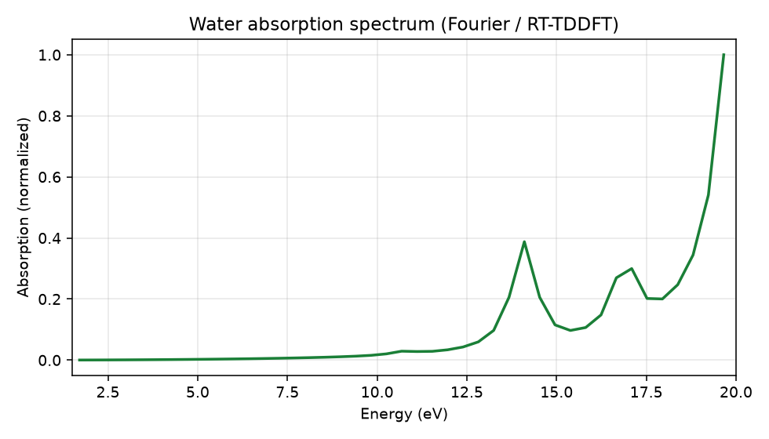
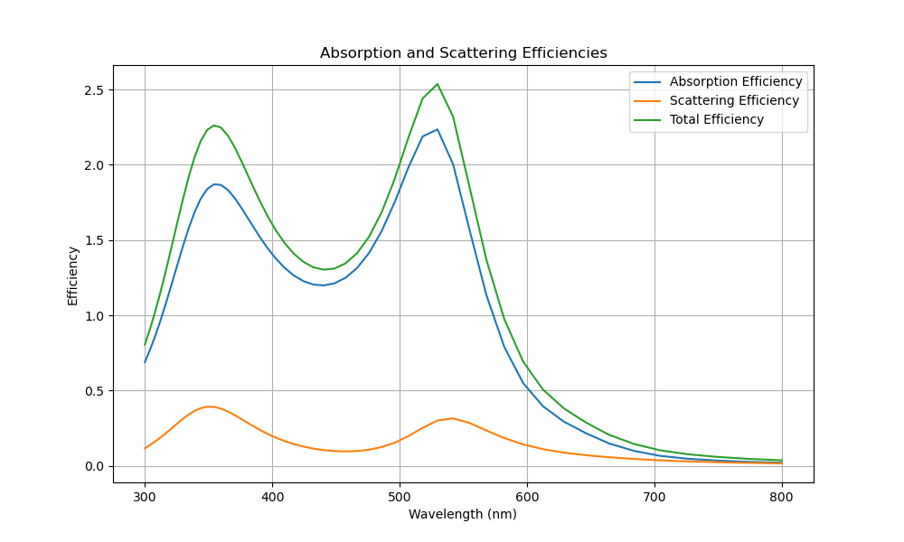
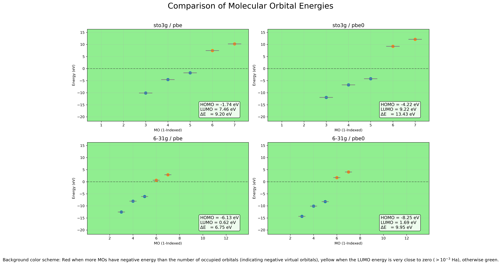
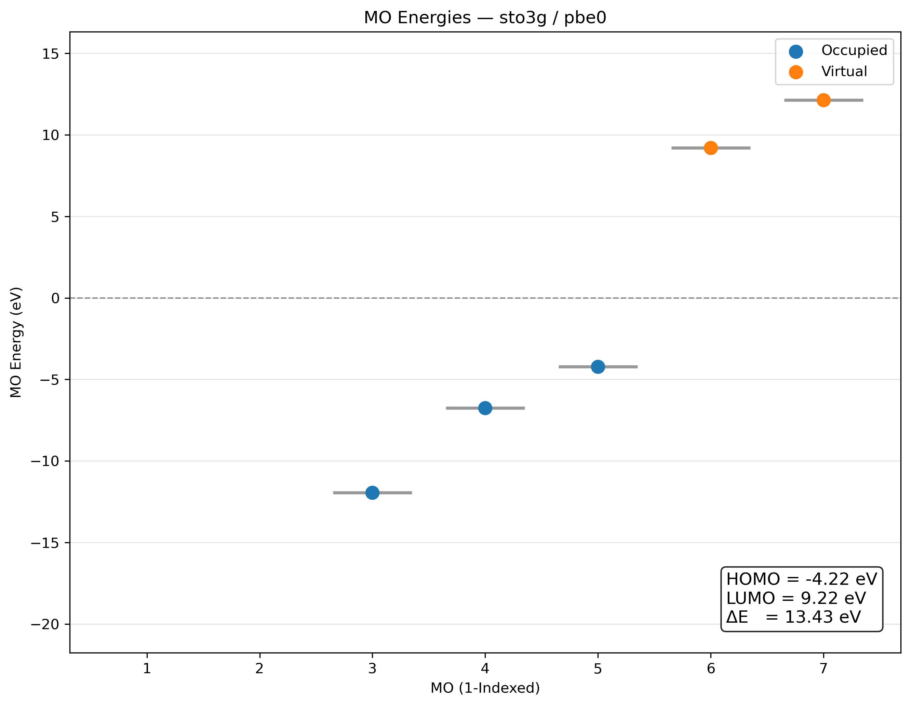
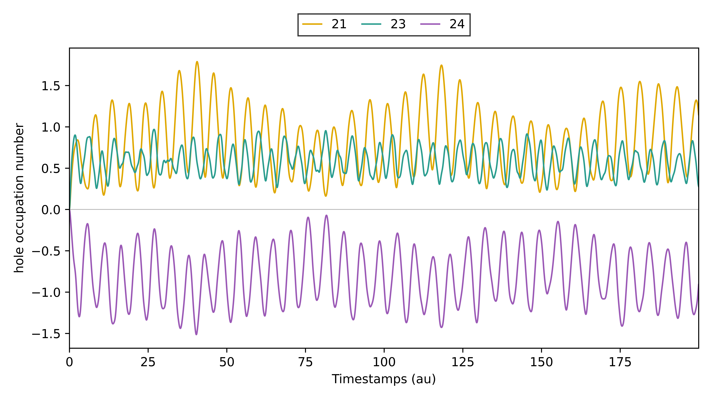
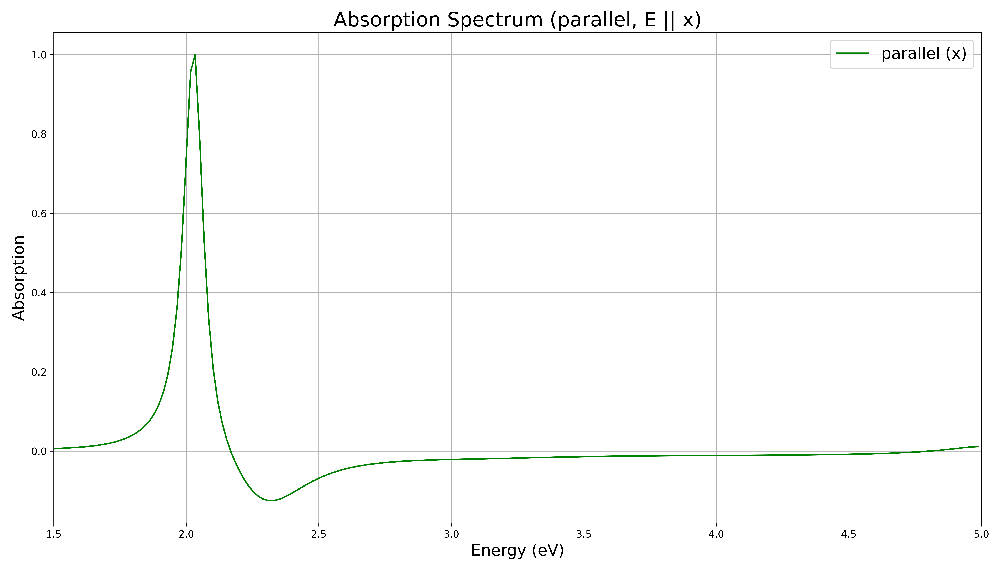

# Tutorials

## Tutorial 1: Classical Nanoparticle Simulation (FDTD Only)

Simulate a gold sphere in water interacting with a continuous-wave source. Produces field CSVs and optional PNG/GIF frames.

**JSON input** (`classical.json`):

```json
{
  "settings": {
    "dt": 0.1,
    "t_end": 50
  },
  "plasmon": {
    "simulation": {
      "cell_length": 0.1,
      "pml_thickness": 0.01,
      "surrounding_material_index": 1.33,
      "symmetries": ["Y", 1, "Z", -1]
    },
    "source": {
      "type": "continuous",
      "center": [-0.04, 0, 0],
      "size": [0, 0.1, 0.1],
      "component": "z",
      "amplitude": 1.0,
      "is_integrated": true,
      "additional_parameters": {
        "frequency": 5.0
      }
    },
    "nanoparticle": {
      "material": "Au_JC_visible",
      "radius": 0.03,
      "center": [0.0, 0.0, 0.0]
    },
    "images": {
      "timesteps_between": 2,
      "dir_name": "classical_frames",
      "make_gif": true,
      "additional_parameters": [
        "-m -1",
        "-M 1",
        "-Zc dkbluered",
        "-S 3"
      ]
    }
  },
  "files": {
    "field_e_filepath": "field_e.csv"
  }
}
```

The `images.additional_parameters` list is passed to Meep’s `output_png` / `h5topng`. Fixed color bounds (`-m` minimum, `-M` maximum) keep the blue–white–red scale consistent across frames so the GIF is readable; `-Zc dkbluered` sets the palette and `-S` scales the image size.

**Run**:

```bash
python -m plasmol.main -f classical.json -vv -l classical.log
```

**Outputs**:

- `field_e.csv` — Electric field time series at origin (or probe points if added).
- `classical_frames/` + `classical_frames.gif` — 2D slices of $E_z$.

**Results**:


Animated $E_z$ around the gold nanoparticle under continuous-wave drive (`-m -1`, `-M 1`, `dkbluered` palette). Red/blue show opposite field polarity; white is near zero.

---

## Tutorial 2: Quantum RT-TDDFT — Induced Dipole of a Molecule

Compute the time-dependent induced dipole of a water molecule under a pulsed electric field.

**JSON input** (`quantum_pulse.json`):

```json
{
  "settings": {
    "dt": 0.1,
    "t_end": 40
  },
  "molecule": {
    "geometry": [
      {"atom": "O", "coord": [0.0, 0.0, -0.1302]},
      {"atom": "H", "coord": [1.4891, 0.0, 1.0332]},
      {"atom": "H", "coord": [-1.4891, 0.0, 1.0332]}
    ],
    "geometry_units": "bohr",
    "basis": "sto3g",
    "xc": "pbe0",
    "charge": 0,
    "spin": 0,
    "propagator": {
      "type": "magnus2",
      "pc_convergence": 1e-10,
      "max_iterations": 50
    },
    "source": {
      "type": "kick",
      "intensity": 0.001,
      "peak_time": 0.0,
      "width_steps": 1,
      "component": "z"
    }
  },
  "files": {
    "field_e_filepath": "field_e.csv",
    "field_p_filepath": "field_p.csv",
    "spectra_e_vs_p_filepath": "field_vs_polarization.png"
  }
}
```

**Run**:

```bash
python -m plasmol.main -f quantum_pulse.json -vv -l quantum.log
```

**Outputs**:

- `field_e.csv` + `field_p.csv` — Incident field and induced dipole (polarization) vs time.
- `field_vs_polarization.png` — Side-by-side plot (generated automatically).

**Results**:


The left panel is the δ-kick electric field; the right panel is the induced molecular dipole response along the drive axis.

---

## Tutorial 3: Molecular Absorption Spectrum (Fourier Workflow)

Compute the absorption spectrum of water using three directional delta-kick simulations + Fourier transform. This is the recommended way to obtain spectra.

**JSON input** (`absorption_spectrum.json`):

```json
{
  "settings": {
    "dt": 0.1,
    "t_end": 4000,
    "driver": "fourier"
  },
  "molecule": {
    "geometry": [
      {"atom": "O", "coord": [0.0, 0.0, -0.1302]},
      {"atom": "H", "coord": [1.4891, 0.0, 1.0332]},
      {"atom": "H", "coord": [-1.4891, 0.0, 1.0332]}
    ],
    "geometry_units": "bohr",
    "charge": 0,
    "spin": 0,
    "basis": "6-31g",
    "xc": "pbe0",
    "propagator": {"type": "magnus2"},
    "source": {
      "type": "kick"
    }
  },
  "files": {
    "field_e_filepath": "field_e.csv",
    "field_p_filepath": "field_p.csv",
    "spectra_e_vs_p_filepath": "raw_response.png"
  },
  "additional_parameters": {
    "fourier": {
      "gamma": 0.005,
      "min_ev": 1.5,
      "max_ev": 12.0,
      "spectrum_filepath": "water_absorption_spectrum.png",
      "tau": 0.01
    }
  }
}
```

**Run**:

```bash
python -m plasmol.main -f absorption_spectrum.json -vv -l spectrum.log
```

PlasMol automatically runs **three parallel simulations** (x/y/z kicks), applies damping, performs the FFT, and produces a normalized absorption spectrum.

**Outputs**:

- `x_dir/`, `y_dir/`, `z_dir/` subdirectories with per-direction CSVs.
- `water_absorption_spectrum.png` — Final absorption spectrum (eV vs. intensity).

**Results**:



Peak-normalized absorption from three directional $\delta$-kicks + FFT (with damping). Features above $\sim 12\,\mathrm{eV}$ reflect the molecular response on the chosen basis / functional; longer $t_{\mathrm{end}}$ and larger bases improve frequency resolution and line shapes.

---

## Tutorial 4: Full Hybrid PlasMol Simulation (NP + Molecule)

Gold nanoparticle + water molecule inside the FDTD grid. The molecule feels the local field; its induced dipole is fed back into Meep.

**JSON input** (`hybrid.json`):

```json
{
  "settings": {
    "dt": 0.1,
    "t_end": 50,
    "driver": "plasmol"
  },
  "plasmon": {
    "simulation": {
      "cell_length": 0.12,
      "pml_thickness": 0.015,
      "surrounding_material_index": 1.33
    },
    "source": {
      "type": "gaussian",
      "center": [-0.05, 0.0, 0.0],
      "size": [0.0, 0.08, 0.08],
      "component": "z",
      "is_integrated": true,
      "additional_parameters": {
        "frequency": 2.5,
        "fwidth": 0.8
      }
    },
    "nanoparticle": {
      "material": "Au_JC_visible",
      "radius": 0.025,
      "center": [0.0, 0.0, 0.0]
    },
    "molecule": {
      "position": [0.035, 0.0, 0.0],
      "tolerance_field_e": 1e-12,
      "back_propagation": true
    },
    "images": {
      "timesteps_between": 5,
      "dir_name": "hybrid_frames",
      "make_gif": true,
      "additional_parameters": [
        "-m -5e-5",
        "-M 5e-5",
        "-Zc dkbluered",
        "-S 3"
      ]
    }
  },
  "molecule": {
    "geometry": [
      {"atom": "O", "coord": [0.0, 0.0, -0.1302]},
      {"atom": "H", "coord": [1.4891, 0.0, 1.0332]},
      {"atom": "H", "coord": [-1.4891, 0.0, 1.0332]}
    ],
    "geometry_units": "bohr",
    "charge": 0,
    "spin": 0,
    "basis": "6-31g",
    "xc": "pbe0",
    "propagator": {"type": "magnus2"}
  },
  "files": {
    "field_e_filepath": "field_e.csv",
    "field_p_filepath": "field_p.csv",
    "spectra_e_vs_p_filepath": "hybrid_response.png"
  }
}
```

As in Tutorial 1, `images.additional_parameters` sets a fixed h5topng color scale (`-m` / `-M`) so the hybrid field GIF has consistent, readable contrast. Bounds are in **Meep field units** (not atomic units); for this short Gaussian drive the local $|E_z|$ is $\sim 10^{-5}$, so a tighter window than Tutorial 1 is used.

**Run**:

```bash
python -m plasmol.main -f hybrid.json -vv -l hybrid.log
```

**What happens internally**:

1. Meep starts with the Au sphere and incident source.
2. Every time step, if |E| at molecule position > tolerance, the quantum propagator is called.
3. Induced dipole is stored and injected back into Meep as a CustomSource (point dipole).
4. Both `field_e.csv` (local field felt by molecule) and `field_p.csv` (molecular response) are written.

This is the core capability of PlasMol for studying plasmon-enhanced phenomena (SERS, energy transfer, etc.). However, with just the
default `plasmol` driver, it only gives the measured induced dipole of the molecule.

**Results**:


Time series of the local electric field sampled at the molecular site (left) and the molecule’s induced dipole response (right) during the hybrid Au NP + water run. The $z$ channel carries the driven pulse; weaker transverse components appear through scattering and coupling.


Animated $E_z$ in the hybrid cell (`-m -5e-5`, `-M 5e-5`, `dkbluered`). The nanoparticle-perturbed pulse and near-field structure evolve through the Gaussian drive window.

---

## Tutorial 5: Nanoparticle Absorption & Scattering Cross-Sections

Use the dedicated `np_abs_cross_sec` driver to compute absorption, scattering, and extinction efficiencies of a nanoparticle (Mie-type calculation with flux boxes).

Add to your JSON:

```json
{
  "settings": {
    "dt": 0.07,
    "t_end": 14500.01,
    "driver": "np_abs_cross_sec"
  },
  "plasmon": {
    "simulation": {
      "cell_length": 0.2,
      "pml_thickness": 0.05,
      "symmetries": ["Y", 1, "Z", -1]
    },
    "source": {
      "type": "gaussian",
      "center": [-0.05, 0, 0],
      "size": [0, 0.2, 0.2],
      "component": "z",
      "is_integrated": true,
      "additional_parameters": {
        "frequency": 2.291666667,
        "fwidth": 2.083333335
      }
    },
    "nanoparticle": {
      "material": "Au_JC_visible",
      "radius": 0.025,
      "center": [0, 0, 0]
    }
  }
}
```

Then run with that driver. The script produces `output_arrays.txt`, efficiency plots, and a multi-peak Lorentzian fit of the plasmon resonance.

For hybrid NP+molecule *spectra*, prefer the `fourier` driver with a plasmon section (see [Fourier Spectra](methodology/fourier.md)).

**Results**:



---

## Advanced / Custom Workflows

- **Adding custom observables**: In `quantum/molecule.py` add a new method (e.g. `calculate_sers_enhancement()`), then call it inside `quantum/propagation.py` after each step. The result can be written to CSV.
- **New electric field shapes**: Add to `classical/sources.py` (MEEPSOURCE) or `quantum/sources.py` (QUANTUMSOURCE) and register in the JSON schema via `params.py`.
- **New propagators**: Implement in `quantum/propagators/`, add to the map in `params.py`, and update validation.

All extension points are documented with comments in the source code.

The tutorials above cover the vast majority of use cases. The following tutorials, however, are meant to give examples of the custom drivers written 

---

## Tutorial 6: Molecular Orbital Energy Comparison

Quickly compare HOMO/LUMO and orbital energies across multiple basis sets and functionals (very useful for method benchmarking).

**JSON input** (`mo_comparison.json`):

```json
{
  "settings": {
    "dt": 0.1,
    "t_end": 10,
    "driver": "comparison"
  },
  "molecule": {
    "geometry": [
      {"atom": "O", "coord": [0.0, 0.0, -0.1302]},
      {"atom": "H", "coord": [1.4891, 0.0, 1.0332]},
      {"atom": "H", "coord": [-1.4891, 0.0, 1.0332]}
    ],
    "geometry_units": "bohr",
    "charge": 0,
    "spin": 0,
    "basis": "6-31g",
    "xc": "pbe0",
    "propagator": {"type": "magnus2"}
  },
  "additional_parameters": {
    "comparison": {
      "bases": ["6-31g", "6-31g*", "def2-svp", "aug-cc-pvdz"],
      "xcs": ["pbe0", "b3lyp", "cam-b3lyp"],
      "lrc_parameters": {"cam-b3lyp": 0.33},
      "num_occupied": 5,
      "num_virtual": 8,
      "y_min": -0.8,
      "y_max": 0.6,
      "dir_name": "mo_comparison"
    }
  }
}
```

**Run**:

```bash
python -m plasmol.main -f mo_comparison.json -vv
```

**Outputs**:

- `mo_comparison/individuals/` — One PNG per (basis, xc) pair.
- `mo_comparison/all_mo_energies.png` — Beautiful grid plot with HOMO/LUMO annotations and color-coded background (red = negative virtual orbitals, yellow = near-zero LUMO, green = healthy).

The comparison driver only performs ground-state SCF calculations — no time propagation is needed.

**Results**:



Single panel example (sto3g + PBE0):



---

## Tutorial 7: Core-Hole (SCH / DCH) MO Tracking

Create a sudden double core-hole on MO 0 and track hole occupations:

```json
{
  "settings": {
    "dt": 0.05,
    "t_end": 200,
    "driver": "dch"
  },
  "molecule": {
    "geometry": "3p.xyz",
    "geometry_units": "angstrom",
    "charge": 0,
    "spin": 0,
    "basis": "6-311G*",
    "xc": "PBE0",
    "propagator": {
      "type": "magnus2",
      "pc_convergence": 1e-8,
      "max_iterations": 200
    },
    "hermiticity_tolerance": 1e-12
  },
  "files": {
    "field_e_filepath": "field_e.csv",
    "field_p_filepath": "field_p.csv",
    "spectra_e_vs_p_filepath": "output.png"
  },
  "additional_parameters": {
    "mo_removal_index_dict": {"0": 2},
    "dch_watch_indices": [21, 23, 24],
    "dch_mo_occ_filepath": "mo_occ.csv"
  }
}
```

3p.xyz:
```xyz
16
3-Pentanone (NWChem optimized conformation 6-311G*/PBE0)
C    -0.02585501    -2.53946034    -0.50367261
C    -0.44363264    -1.37313018     0.37206036
C    -0.15091510    -0.01857470    -0.24303723
O     0.47542696     0.09277836    -1.26870597
C    -0.68887019     1.18842474     0.50043570
C    -0.21762616     2.51221721    -0.07166649
H     1.03999621    -2.49248776    -0.73476088
H    -0.56010095    -2.52751457    -1.45645780
H    -0.22977069    -3.49303368    -0.01017758
H    -1.51177601    -1.41921394     0.62079454
H     0.07043999    -1.40846680     1.34260507
H    -0.42389703     1.09144241     1.56120751
H    -1.78548325     1.12119501     0.47976102
H    -0.65541451     3.35273246     0.47266842
H    -0.49243996     2.60284823    -1.12425761
H     0.86990233     2.60003036    -0.01678504
```

- Use `"check_mo_contrib_by_atom": true` first to survey which atoms dominate candidate MOs.
- Full theory: [Core-Hole Dynamics](methodology/core_hole.md).

**Results**:

3-pentanone double core-hole on MO 0 (`{"0": 2}`):




---

## Tutorial 8: Hybrid Fourier Parallel vs Perpendicular

For a molecule on the +x side of an Au sphere, compute orientation-resolved hybrid spectra:

```json
{
  "settings": {
    "dt": 0.1,
    "t_end": 10000,
    "driver": "fourier"
  },
  "plasmon": {
    "simulation": {
      "cell_length": 0.2,
      "pml_thickness": 0.05
    },
    "source": {
      "type": "gaussian",
      "center": [-0.04, 0, 0],
      "size": [0, 0.2, 0.2],
      "component": "z",
      "is_integrated": true,
      "additional_parameters": {
        "frequency": 2.291666667,
        "fwidth": 2.083333335
      }
    },
    "nanoparticle": {
      "material": "Au",
      "radius": 0.025,
      "center": [0, 0, 0]
    },
    "molecule": {
      "position": [0.026451, 0, 0]
    }
  },
  "molecule": {
    "geometry": "Na.xyz",
    "geometry_units": "bohr",
    "charge": 0,
    "spin": 1,
    "basis": "631g*",
    "xc": "HYB_GGA_XC_LC_WPBE",
    "lrc_parameter": 0.339181,
    "propagator": {
      "type": "magnus2",
      "pc_convergence": 1e-12,
      "max_iterations": 200
    },
    "hermiticity_tolerance": 1e-12,
    "cap": {
      "type": "static",
      "gam0": 1,
      "xi": 0.5,
      "eps0": 0.023007,
      "clamp": 100
    }
  },
  "files": {
    "field_e_filepath": "field_e.csv",
    "field_p_filepath": "field_p.csv",
    "spectra_e_vs_p_filepath": "output.png"
  },
  "additional_parameters": {
    "fourier": {
      "polarization": "parallel",
      "spectrum_filepath": "spectrum_parallel.png",
      "npz_filepath": "fourier_parallel.npz",
      "min_ev": 1.5,
      "max_ev": 5.0,
      "field_e_ref_filepath": "field_e_ref_parallel.csv"
    }
  }
}
```

Na.xyz:
```xyz
Na
1

Na    0.00000000    0.00000000    0.00000000
```

Switch `"polarization": "perpendicular"` for the tangential spectrum. Details: [Fourier Spectra](methodology/fourier.md) § Parallel and perpendicular.

**Results**:

The result gives the absorption spectrum of the molecule (here it is a single Na atom) under the influence of the NP's electric field:
